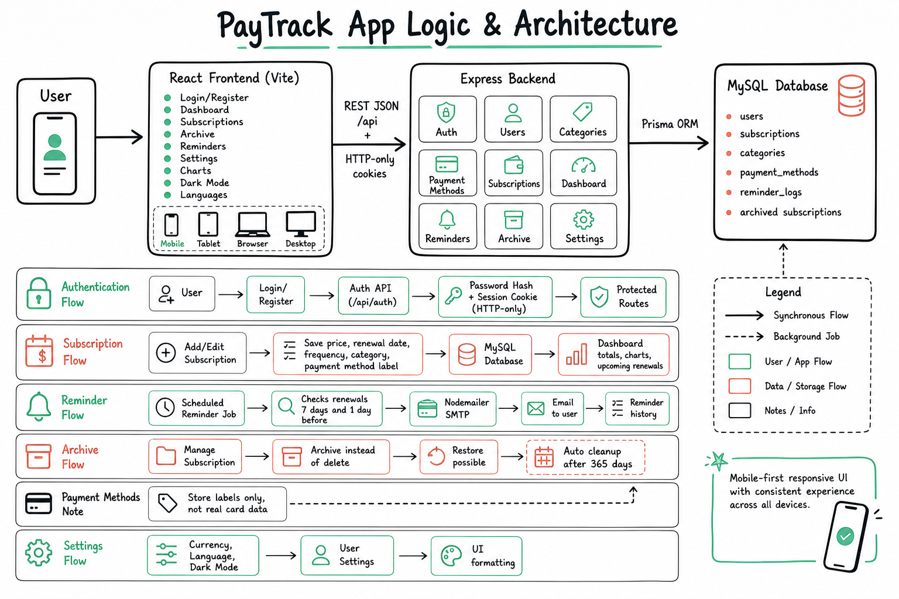

# PayTrack Backend

Express API for the PayTrack subscription manager.

## Stack

- Node.js
- Express
- Prisma
- MySQL
- JWT HTTP-only cookie sessions
- Nodemailer
- node-cron
- Zod

## Architecture Flow



## Local Setup

```bash
npm install
cp .env.example .env
docker compose up -d mysql
npm run prisma:migrate
npm run db:seed
npm run prisma:generate
npm run dev
```

The API runs on `http://localhost:5318`.

Health check:

```bash
curl http://localhost:5318/health
```

## Development Credentials

After running `npm run db:seed`, use:

```text
Email: demo@paytrack.local
Password: PayTrack123!
```
